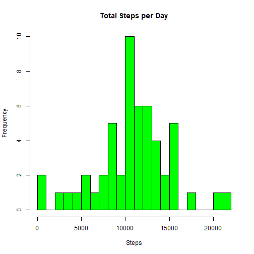
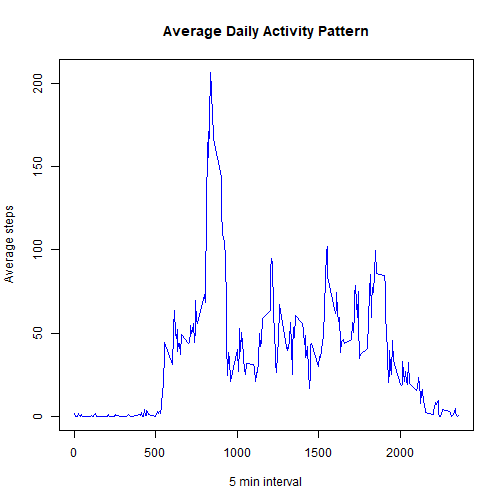
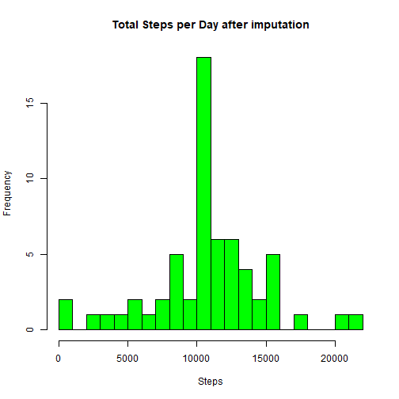
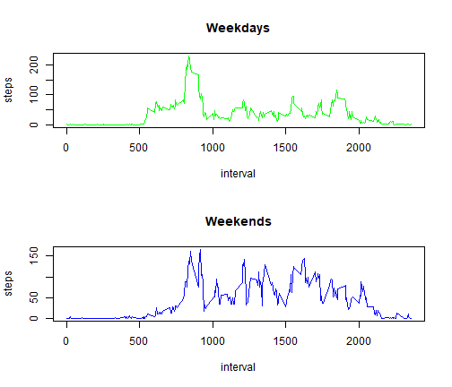

## Introduction
This assignment makes use of data from a personal activity monitoring device. This device collects data at 5 minute intervals through out the day. The data consists of two months of data from an anonymous individual collected during the months of October and November, 2012 and include the number of steps taken in 5 minute intervals each day.


## Load Data

```r
library(data.table)
data<-fread("activity.csv")
```

## 1. What is mean total number of steps taken per day?

```r
sum_step_per_day<- aggregate(steps ~ date, data, sum)
hist(sum_step_per_day$steps, main = "Total Steps per Day", xlab = "Steps", col = "green", breaks = 20)
```



```r
summary(sum_step_per_day$steps)
```

```
##    Min. 1st Qu.  Median    Mean 3rd Qu.    Max. 
##      41    8841   10765   10766   13294   21194
```

### 2. Calculate and report the mean and median total number of steps taken per day

```r
mean_step<- mean(sum_step_per_day$steps)
mean_step
```

```
## [1] 10766.19
```

```r
median_step <- median(sum_step_per_day$steps)
median_step
```

```
## [1] 10765
```
### The mean and median are very close to each other, the median is only a slightly lower than the mean.

## What is the average daily activity pattern?
### 1. Make a time series plot 

```r
avearge_step_per_interval<- aggregate(steps ~interval, data, mean)
plot(avearge_step_per_interval$interval,avearge_step_per_interval$steps,type='l',
     xlab = "5 min interval", ylab = "Average steps", 
     main = "Average Daily Activity Pattern", col = "blue")
```



### 2. Which 5-minute interval, on average across all the days in the dataset, contains the maximum number of steps?

```r
print(avearge_step_per_interval$interval[which.max(avearge_step_per_interval$steps)])
```

```
## [1] 835
```
### This implies that on everage, the most active time interval is around 8.35 am.


## Imputing missing values
### 1. Calculate and report the total number of missing values in the dataset (i.e. the total number of rows with NAs)

```r
print(paste('There are ',nrow(data[is.na(data$steps),]),' missing values'))
```

```
## [1] "There are  2304  missing values"
```

### 2. Impute the missing value by using the mean of that interval

```r
library(dplyr)
data_imputed<-data %>% 
     group_by(interval) %>% 
     mutate(steps=ifelse(is.na(steps),mean(steps,na.rm = TRUE),steps))
```

### 3. Make a histogram of the total number of steps taken each day and Calculate and report the mean and median 

```r
sum_step_per_day_new<- aggregate(steps ~ date, data_imputed, sum)
hist(sum_step_per_day_new$steps, main = "Total Steps per Day after imputation", xlab = "Steps", col = "green", breaks = 20)
```



```r
mean_step_new<- mean(sum_step_per_day_new$steps)
median_step_new <- median(sum_step_per_day_new$steps)
print(mean_step_new)
```

```
## [1] 10766.19
```

```r
print(median_step_new)
```

```
## [1] 10766.19
```
### The mean and median are now become the same, it may due to the fact that we took the mean of the interval to impute missing values

## Are there differences in activity patterns between weekdays and weekends?
### 1. Create a new factor variable indicating weekend or weekday

```r
data_imputed$weekday <- as.POSIXlt(data_imputed$date)$wday
data_imputed$dayfactor <- as.factor(ifelse(data_imputed$weekday == 0 | data_imputed$weekday == 6, "weekend", "weekday"))
data_weekdays<-data_imputed[data_imputed$dayfactor=="weekday",]
data_weekends<-data_imputed[data_imputed$dayfactor=="weekend",]
steps_interval_weekdays <- aggregate(steps ~ interval, data_weekdays, mean)
steps_interval_weekends <- aggregate(steps ~ interval, data_weekends, mean)
```

### 2. Panel time series plot 

```r
par(mfrow = c(2, 1))
plot(steps_interval_weekdays, type = "l", col = "green", main = "Weekdays")
plot(steps_interval_weekends, type = "l", col = "blue", main = "Weekends") 
```


### According to the time series plots, we can see that there are clear differences in activity patterns between weekdays and weekends. During the weekdays, there is a peak in the mornings, and another small peak around 18.45. While in weekends, there are more activity peaks, and the activities last for almost a whole day.
